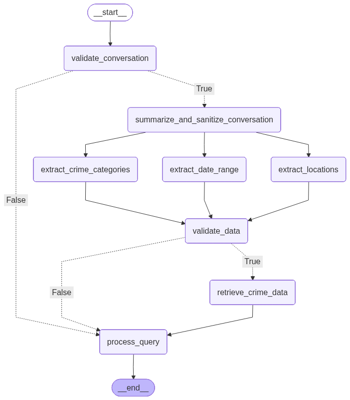

## Architecture 
The chatbot is a FastAPI application and is deployed as a Docker container.

The chatbot uses the LangChain library for natural language processing and managing the graph state.  The behavior and processing flow for the chatbot is outlined in the following graph:
.

The chatbot uses the Pandas AI library for data analysis.  For more information on Pandas AI and what kind of statistics and queries the library supports, please refer to the [Pandas AI](https://github.com/Sinaptik-AI/pandas-ai) website.

## AWS | S3 + LLM 
The chatbot uses AWS S3 for storage and configuration.  The chatbot uses AWS Bedrock for LLM execution.

- The S3 bucket name is specified in the environment variable AWS_S3_BUCKET (defaults to 'rtci')
- The LLM model is specified in the environment variable AWS_BEDROCK_MODEL (defaults to 'anthropic.claude-3-haiku-20240307-v1:0')

For accessing AWS resources, the chatbot uses standard environment variables for authentication and configuration of the boto3 client:

- AWS_ACCESS_KEY_ID
- AWS_SECRET_ACCESS_KEY
- AWS_REGION_NAME (defaults to 'us-east-1')

## Data
The chatbot loads the crime data from a CSV file and stores it in a format easily converted to Pandas DataFrame.  

- The crime data is loaded from a S3 bucket by default.  The S3 resource name is also stored in the environment variable AWS_S3_DATASET_KEY (defaults to 'data/final_sample.csv').
- The crime data is post-processed to covert empty values and NaN values (replacing them with zero).
- The crime data is filtered to exclude national and state-wide data, keeping only city-state data.
- The crime data is cached in memory for 24 hours to avoid re-loaded each query and response flow.

## Locations 
The chatbot loads a list of locations from a CSV file and stores it in memory at startup.

- The locations are loaded from a S3 bucket by default.  The S3 resource name is also stored in the environment variable AWS_S3_LOCATIONS_KEY (defaults to 'data/sample_cities.csv').
- The locations are stored in a vector store to support extracting city/state context from user queries. 
- The locations are cached in memory for the duration of the container.  To update the locations, you need to restart the container.

## Prompts
The chatbot prompts are stored in the 'prompts' directory and are loaded into memory at runtime.  To modify the prompts, update the text file or S3 resource and restart the container.

- In production, the prompts are loaded from S3 bucket by default.  The bucket name is specified in the environment variable AWS_S3_BUCKET (defaults to 'rtci').
- In development, the prompts are loaded from the local directory.

## Deployment
The chatbot is deployed as a Docker container.  There are many service providers that support Docker containers and provisioning managed services (Digital Ocean, Amazon AWS, etc.).  The following steps outline how to deploy the chatbot to a managed service for AWS.  

You can build and push the container to Amazon Elastic Container Registry (ECR).

- Run the 'build.sh' script to build the Docker image and push the image to ECR.
- The registry URI is specified by the environment variable DOCKER_REGISTRY or the '--registry' command line argument. 
- The image tag is controlled by the environment variable DOCKER_TAG (defaults to 'rtci/chatbot').
- For more details on this process, please refer to the [AWS ECR documentation](https://docs.aws.amazon.com/AmazonECR/latest/userguide/docker-push-ecr-image.html).

You can deploy the container to Amazon Elastic Container Service (ECS) or Fargate.

- Find the previously pushed image in ECR.
- Ensure you expose or map port 8000 in the task definition.
- Specify the required AWS environment variables or otherwise configure the task authorization context. 
- For more details on this process, please refer to the [AWS ECS documentation](https://docs.aws.amazon.com/hands-on/latest/deploy-docker-containers/deploy-docker-containers.html).

You may need to review the AWS CLI documentation to authenticate and configure the AWS privileges [AWS CLI](https://docs.aws.amazon.com/cli/latest/userguide/cli-chap-getting-started.html).

For a guide on creating a pipeline from ECR to ECS when you push a new image, please refer to the [AWS ECR and ECS Pipeline](https://docs.aws.amazon.com/codepipeline/latest/userguide/tutorials-ecs-ecr-codedeploy.html).
